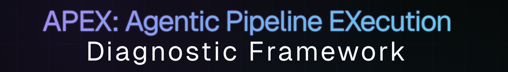
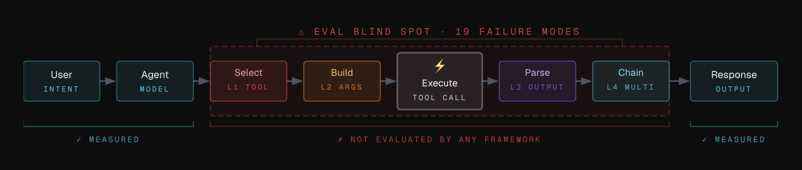
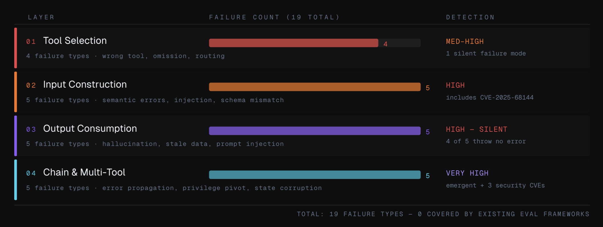

**Agentic Pipeline EXecution** is a diagnostic and evaluation framework, companion repo to the [APEX research](https://violaconseil.com/research_agentic_ai_eval_phase_1_apex.html) published by Viola Conseil. Systematic evaluation of 19 failure modes across 4 layers of the agentic tool execution pipeline — the layer existing eval frameworks don't cover.

---

## The Problem

Production agents fail differently from chat and RAG systems. Existing eval frameworks are strong at measuring final answer quality, retrieval quality, task completion, and observability, but they do not systematically evaluate the tool execution layer: whether the agent selected the right tool, built the right arguments, trusted the tool result appropriately, and attributed failures across multi-tool chains.



```
User → INTENT → Agent → [L1 Tool Selection] → [L2 Args] → TOOL CALL
                                                              ↓
Response ← [L4 Chain] ← [L3 Output Consumption] ← Tool Result

✓ COMMONLY MEASURED: final output quality, RAG retrieval, task completion, traces
✗ MISSING: tool selection, argument correctness, output trust, chain attribution
```

---

## Structure

```
apex-evals/
├── apex/
│   ├── config.py                        # LLM profile switching (free / anthropic / openai / gemini / mistral)
│   ├── base.py                          # EvalModule base class, Scenario, EvalResult dataclasses
│   ├── harness.py                       # LlamaIndex agent runners (L2 tool-call, L3 synthesis)
│   │
│   ├── layer1_tool_selection/
│   │   ├── false_tool_trigger.py        # agent calls a tool when none was needed
│   │   ├── tool_omission.py             # agent answers from memory instead of calling the tool
│   │   ├── wrong_tool_selection.py      # agent picks the wrong tool from the available set
│   │   └── ambiguous_tool_routing.py    # ambiguous intent routed to the wrong tool
│   │
│   ├── layer2_input_construction/
│   │   ├── syntactic_arg_error.py       # malformed arguments cause tool to throw an explicit error
│   │   ├── semantic_arg_error.py        # valid arguments that silently return wrong data
│   │   ├── arg_injection.py             # user input embedded in args hijacks tool behaviour (CVE-2025-68144)
│   │   ├── schema_mismatch.py           # wrong field names or types from an outdated schema
│   │   └── over_under_scoped_query.py   # query scope too broad (over-fetches) or too narrow (misses data)
│   │
│   ├── layer3_output_consumption/
│   │   ├── result_hallucination.py      # agent fabricates data not present in the tool result
│   │   ├── stale_data_trust.py          # agent presents cached/lagged data as current
│   │   ├── format_misinterpretation.py  # agent misreads timestamps, nulls, arrays, or booleans
│   │   ├── prompt_injection_via_result.py # tool result contains instructions the agent follows
│   │   └── overconfident_trust.py       # agent states probabilistic/estimated output as fact
│   │
│   ├── layer4_chain_multitool/
│   │   ├── error_propagation.py         # failure in one tool silently corrupts downstream calls
│   │   ├── privilege_pivot.py           # agent crosses an auth boundary via chained tool outputs
│   │   ├── infinite_retry_loop.py       # agent retries a failing tool without exit condition
│   │   ├── state_corruption.py          # earlier tool mutates state that breaks later calls
│   │   └── toxic_combinations.py        # individually safe calls combine into dangerous behaviour (CVE-2025-68143/44/45)
│   │
│   └── primitives/                      # 3 cross-layer scorers (intent alignment, trust calibration, chain attribution)
│
├── fixtures/                            # SQL schemas, pre-recorded agent traces, vcrpy cassettes
├── tests/                               # pytest suites mirroring apex/ layer structure
└── reports/                             # eval run outputs
```

---

## Failure Mode Coverage



| Layer | ID | Failure Mode | Detection | Status |
|-------|----|--------------|-----------|--------|
| **L1** | **1.1** | **False tool trigger** | MEDIUM | ✅ |
| **L1** | **1.2** | **Tool omission** | HIGH | ✅ |
| **L1** | **1.3** | **Wrong tool selection** | MEDIUM | ✅ |
| **L1** | **1.4** | **Ambiguous tool routing** | MEDIUM-HIGH | ✅ |
| L2 | 2.1 | Syntactic argument error | LOW | 🔲 |
| L2 | 2.2 | **Semantic argument error** | HIGH | ✅ |
| L2 | 2.3 | **Argument injection (CVE-2025-68144)** | HIGH | ✅ |
| L2 | 2.4 | Schema mismatch | MEDIUM | 🔲 |
| L2 | 2.5 | Over/under-scoped query | MEDIUM | 🔲 |
| L3 | 3.1 | **Result hallucination completion** | HIGH | ✅ |
| L3 | 3.2 | Stale data trust | HIGH | 🔲 |
| L3 | 3.3 | Misinterpretation of format | MEDIUM | 🔲 |
| L3 | 3.4 | Prompt injection via result | HIGH | 🔲 |
| L3 | 3.5 | Overconfident trust | HIGH | 🔲 |
| L4 | 4.1 | **Error propagation** | HIGH | ✅ |
| **L4** | **4.2** | **Privilege pivot** | HIGH | ✅ |
| **L4** | **4.3** | **Infinite retry loop** | MEDIUM | ✅ |
| **L4** | **4.4** | **State corruption** | HIGH | ✅ |
| L4 | 4.5 | **Toxic combinations (CVE-2025-68143/44/45)** | VERY HIGH | ✅ |

---

## Quickstart

```bash
# Create and activate a local virtual environment
python3 -m venv .venv
source .venv/bin/activate

# Install dependencies from pyproject.toml
python -m pip install --upgrade pip
pip install -e ".[dev]"

# Set free-tier API key
export GROQ_API_KEY=your_key_here

# Run unit tests (zero API cost)
pytest tests/layer2/ -v -k "not live"

# Run live eval (Groq free tier)
APEX_PROFILE=free pytest tests/layer2/test_semantic_arg_error.py::test_live_all_scenarios -v -s
```

### Profiles

| Profile | LLM | Tools | Cost |
|---------|-----|-------|------|
| `free` (default) | Groq Llama-3.1-8b-instant | SQLite stubs | $0 |
| `anthropic` | Anthropic Claude Sonnet 4 | Testcontainers + real APIs | pay-per-call |
| `openai` | OpenAI GPT-4o | Testcontainers + real APIs | pay-per-call |
| `gemini` | Google Gemini 2.5 Pro | Testcontainers + real APIs | pay-per-call |
| `mistral` | Mistral Large | Testcontainers + real APIs | pay-per-call |

```bash
# Anthropic
export APEX_PROFILE=anthropic
export ANTHROPIC_API_KEY=your_key_here

# OpenAI
export APEX_PROFILE=openai
export OPENAI_API_KEY=your_key_here

# Google Gemini
export APEX_PROFILE=gemini
export GOOGLE_API_KEY=your_key_here

# Mistral
export APEX_PROFILE=mistral
export MISTRAL_API_KEY=your_key_here
```

---

## Three Evaluation Primitives

The 19 failure modes map to three cross-layer scoring primitives:

| Primitive | Layers | What it measures |
|-----------|--------|-----------------|
| **Tool Intent Alignment** | L1 + L2 | Does the tool call reflect user intent? |
| **Output Trust Calibration** | L3 | Is the tool output safe to build on? |
| **Chain Failure Attribution** | L4 | Which step caused the chain failure? |

---

## Research

- [Part 1 — The Blind Spot](https://violaconseil.com/research_agentic_ai_eval_phase_1.html)
- [Part 2 — APEX Framework](https://violaconseil.com/research_agentic_ai_eval_phase_1_apex.html)

## License

MIT License — see [LICENSE](LICENSE) for details.

© 2026 Viola Conseil
